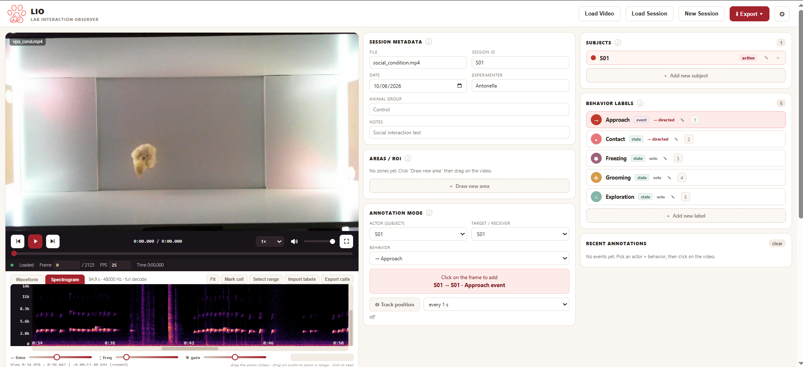

<p align="center">
  
</p>

# Lab Interaction Observer (LIO)

A Windows desktop application for annotating the behavior of **one or more
subjects** in a video, aligning vocalisations to behaviour, and exporting
data for downstream analysis.

The app is a native Win32 window (`.exe`) hosting a WebView2 control. The
entire user interface lives in `assets/LIO.html`; the C++ shell handles the
native window, the Windows "open video" dialog, and the "save CSV" dialog.

This is the same architecture used by VS Code, Spotify and Discord: the user
sees a normal native Windows application.



## What it does

- Loads a video (mp4, avi, mov, mkv, webm) through a native Windows dialog
- Define one or more **subjects** (S01, S02, …), each with sex and colour;
  any subject can be **edited** later (ID, sex, colour) via the pencil icon
- Define **areas / ROIs** by drag-drawing rectangles on the video
- **Structured ethogram.** Each behaviour label has a **type**:
  - **state** — has a duration. First click on the video opens it,
    second click closes it; the duration is recorded.
  - **event** — instantaneous. A single click records it.
  - Each label also has an optional **operational definition** (free
    text) and an **exclusivity** flag (starting an exclusive state
    closes other exclusive states on the same subject).
- Record events by clicking on the video:
  - **Directed (dyadic)** behaviors — Approach, Contact — record an
    **Actor → Receiver** pair
  - **Solo** behaviors — Grooming, Freezing, Exploration — record only
    an Actor
- **Recent annotations** lists every event, with the duration of each
  state and a marker for states still in progress; each row can be
  deleted individually (metrics and trajectories recompute
  automatically)
- Per-subject coloured trajectories drawn on the video

### Position tracking and zones

- **Track position** button: while it is on, every click on the video
  records the subject's position and the zone it falls in (separate
  from behavioural annotation).
- Optional **auto-sampling** at 0.5 / 1 / 2 / 5 seconds while the video
  is playing: a position point is captured automatically at the last
  known location.
- From the tracking points LIO computes the **sequence of zones**
  visited and the **time spent** in each zone, and produces a separate
  **Zone visits CSV** (long format: one row per visit with entry, exit
  and duration).

Tracking accuracy is bounded by how often points are recorded. This is
manual coarse tracking, not automatic pose tracking. For pose-level
spatial analysis, use DeepLabCut or SLEAP.

### Audio panel

- Waveform and spectrogram tabs
- Three sliders below the spectrogram: **time zoom**, **frequency
  zoom**, and **gain**
- The colour mapping uses Audacity's gain/range model on a normalised
  FFT: the gain slider is Audacity's "Gain" (default 20 dB); the range
  is set to 50 dB (Audacity's own default is 80 dB, which suits music —
  50 dB was tuned on real chick recordings so the noise floor stays
  black). Gain affects the display only, never the FFT data.
- The spectrogram uses a fixed 1024-sample FFT window with 75% overlap
- It is computed in the background with a **progress bar** so long
  videos stay responsive
- **Drag across the audio** (with no tool active) to zoom into a time
  range; **click** to seek the video
- Horizontal and vertical **scrollbars** to pan time and frequency
- A **frequency axis** (kHz) down the left side
- Live **readout** of the time and frequency under the cursor

### Call marking

- **Mark call** mode (Sonic-Visualiser style): first click sets the
  call **onset**, mouse movement shows the region growing in real time,
  second click sets the **offset**. The region is a full-height cyan
  band with sharp onset/offset edges — frequency is not marked by hand
  (the external pipeline measures it).
- A small **label panel** opens inside the audio area: type the call
  label, or pick one of the **reusable label chips** (labels already
  used in the session). LIO does not auto-classify calls.
- Click on any existing call (outside Mark mode) to edit its label or
  delete it. Hovering shows a `Del to remove` hint.

### Importing calls from an external pipeline

- **Import labels** loads a CSV / TSV from the file dialog
- Header detection is automatic; delimiter is auto-detected
  (comma / tab / semicolon)
- LIO recognises common time-column names (`start`, `end`, `onset`,
  `offset`, `begin`, `time`) and optional frequency-band columns
  (`freq_low_hz`, `freq_high_hz`, `fmin`, `fmax`, …)
- Every other column is carried along as a feature, untouched
  (e.g. `F0 Mean`, `F0 Std`, `Duration_call`, `RMS`, …). Imported and
  hand-marked calls coexist.

### Linking calls to behaviour

- For each call, LIO finds the **behavioural states active at the
  call's midpoint** and links the call to them. The linkage updates
  whenever an annotation changes.
- A collapsible **Calls × behaviour** table sits under the audio panel:
  one row per call, with time, label, active state(s), area/ROI, and
  subject(s).
- The unified export is `*_calls_behaviour.csv`. Column order:
  ```
  file_name, session_id, behaviour_state, area_roi,
  call_index, subject, active_subjects, n_active_states,
  call_start, call_end, call_duration,
  freq_low_hz, freq_high_hz, call_label,
  feat_<every imported feature column>
  ```
  `area_roi` is filled only when a position-tracking point falls inside
  the call's onset/offset window. If no tracking point falls in that
  window, the field is left empty rather than estimated.

### Selecting a range to export

- **Select range** mode: drag on the audio to choose a time interval;
  the band is drawn in dashed amber. The Calls × behaviour export will
  then cover only the calls inside the selection. With no selection,
  the export covers all calls. The export menu shows how many calls
  will be exported.

### Exports

- **Per-subject CSV** — one row per subject with summary metrics
  (distance, n events, zones reached, time per zone, zone sequence)
- **Zone visits CSV** — long format, one row per visit
  (`subject_id, visit_index, zone, entry_time, exit_time, duration`)
- **Dyadic interactions CSV** — `actor_id, receiver_id, behavior,
  count, first_time_s, last_time_s` — ready for `networkx` / `igraph`
- **Calls × behaviour CSV** — described above
- **Event log CSV** — one row per click
- **HTML report** and **session JSON** (re-openable)

A single `time_unit` column at the start of the per-subject and
zone-visits CSV declares whether times are in seconds or milliseconds.
The unit is chosen once, from the Export menu (`Time unit in CSV:
seconds | ms`).

With a single subject, the dyadic CSV is simply empty and you use the
per-subject CSV. With two or more, you also get the interaction matrix.

## Requirements to build

1. **Visual Studio 2022** with the **Desktop development with C++** workload
   (this includes the Windows 10/11 SDK and the v143 toolset).
2. Nothing else needs to be pre-installed — the WebView2 SDK is pulled in
   automatically as a NuGet package on first build.

The end users who *run* the `.exe` need the **Microsoft Edge WebView2
Runtime**. It is already present on Windows 11 and on most updated Windows 10
machines; if missing, it is a small free download from Microsoft (the app
shows a message telling them so).

## How to build (step by step)

1. Unzip this folder anywhere.
2. Double-click **`LIO.sln`** to open it in Visual Studio 2022.
3. The first time, restore the NuGet package:
   right-click the **solution** in Solution Explorer →
   **Restore NuGet Packages**.
   (If Visual Studio asks to restore automatically, just say yes.)
4. At the top, set the configuration to **Release** and platform to **x64**.
5. Press **F7** (Build) or **Ctrl+F5** (Build & Run).

The result is:

```
build\x64\Release\LIO.exe
build\x64\Release\assets\LIO.html      <- copied automatically
build\x64\Release\WebView2Loader.dll   <- copied automatically by NuGet
```

`LIO.exe` together with the `assets` folder and `WebView2Loader.dll` is the
complete distributable application. To share it, zip those three items.

## Project layout

```
LIO_app/
├── LIO.sln                  Visual Studio solution
├── LIO.vcxproj              Project file (WebView2 NuGet + asset copy)
├── LIO.vcxproj.filters
├── packages.config          Declares the WebView2 NuGet package
├── README.md
├── assets/
│   ├── LIO.html             The whole UI (multi-subject annotation app)
│   ├── LIO_logo.png         Logo used in the README
│   └── screenshot_lio_v01.png
└── src/
    ├── main.cpp             wWinMain entry point
    ├── MainWindow.cpp/.h     Win32 window + WebView2 host + JS bridge
    ├── resource.h            Icon resource id
    ├── LIO.rc                Links the icon into the .exe
    └── LIO_logo.ico          Application icon
```

## How the C++ ↔ HTML bridge works

The HTML never touches the file system directly. Instead:

- **Open a video** — the HTML posts `{"type":"openVideo"}`; the C++ shows the
  Windows file dialog, reads the file, and sends the bytes back as base64
  (`{"type":"videoBytes",...}`). The HTML turns those bytes into a `blob:`
  URL. A video loaded from a `blob:` URL can have its audio
  analysed for the waveform / spectrogram, whereas a plain `file:///` video
  cannot (browsers mute Web-Audio output of `file:///` media for security).
  Files larger than 350 MB fall back to a `file:///` path — the video still
  plays, only the audio panel is unavailable.
- **Save a CSV** — the HTML posts `{"type":"saveCSV","data":"..."}`; the C++
  shows the Save-As dialog and writes a UTF-8 file (with BOM, so Excel opens
  it cleanly).

This is implemented in `MainWindow.cpp` (`handleWebMessage`). The `LIO.html`
also works as a plain web page in a browser (it falls back to the normal
file-input / download behaviour).

## Network analysis example (Python)

```python
import pandas as pd, networkx as nx
df = pd.read_csv("video01_dyadic.csv")
G = nx.from_pandas_edgelist(
        df, source="actor_id", target="receiver_id",
        edge_attr="count", create_using=nx.DiGraph)
print(nx.in_degree_centrality(G))
```

## Keyboard shortcuts

- `Space` — play / pause
- `.` / `,` — next / previous frame
- `Shift + .` / `Shift + ,` — jump 10 frames
- `Esc` — cancel ROI drawing or a pending call onset
- `Del` — delete the call under the mouse cursor (on the audio panel)
- `Ctrl + X` — delete the call under the mouse cursor (alternative)
- `Ctrl + O` — load a video
- `Ctrl + Z` — undo the last call action (add / delete / label change)
- `Ctrl + A` — clear any partial range selection (export covers all calls)

Call-undo is intentionally scoped to calls (last 50 actions); a full
application-wide undo is left for a later version.

## Roadmap

v0 (this version) imports calls from an external pipeline and links
them to behavioural annotations. Planned next:

- **Embedded feature extraction.** The Python feature pipeline
  (librosa, scipy, soundfile, pYIN/YIN, harmonics) called as a
  subprocess by the C++ shell, on the audio window of each call. A
  search for `TODO(v1)` in `assets/LIO.html` shows the wiring points;
  the JS side has an inert `extractFeaturesForCall(call)` stub.
- **Distribution.** An installer that bundles Python embeddable and
  the pipeline's dependencies (~250 MB) so the end user only needs
  `LIO.exe`.
- **Inter-observer reliability.** Load two sessions and compute
  agreement (Cohen's κ for events, temporal overlap for states).
- **Behavioural budget.** Time-per-state and frequency-per-event tables
  per subject, derived from the structured ethogram.

## Notes

- The app starts with **one subject** (S01). Use "Add new subject" to add
  more — the dyadic interaction export only has content with 2+ subjects.
- Set the real **FPS** of your video in the playback bar so frame stepping
  and the frame counter are accurate.
- The **audio panel** shows a waveform or a spectrogram (tabs). Click
  anywhere on it to jump the video to that time. With the full-decode path
  the whole track is shown at once; otherwise it fills in as the video
  plays.
- Distance is measured in normalised arena units (0–1 across the frame).
  Use the gear icon (top-right) to set the real arena width in metres so the
  exported distances are in real units.